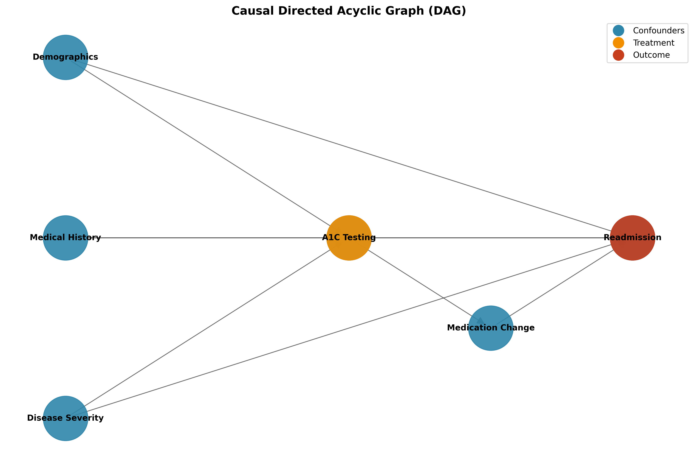
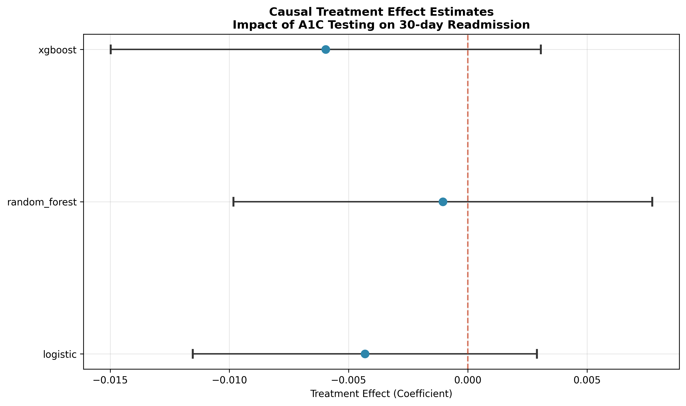
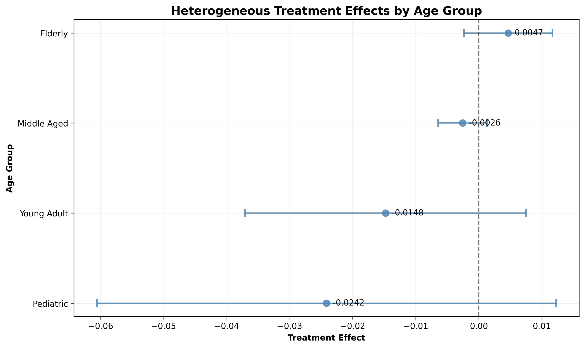
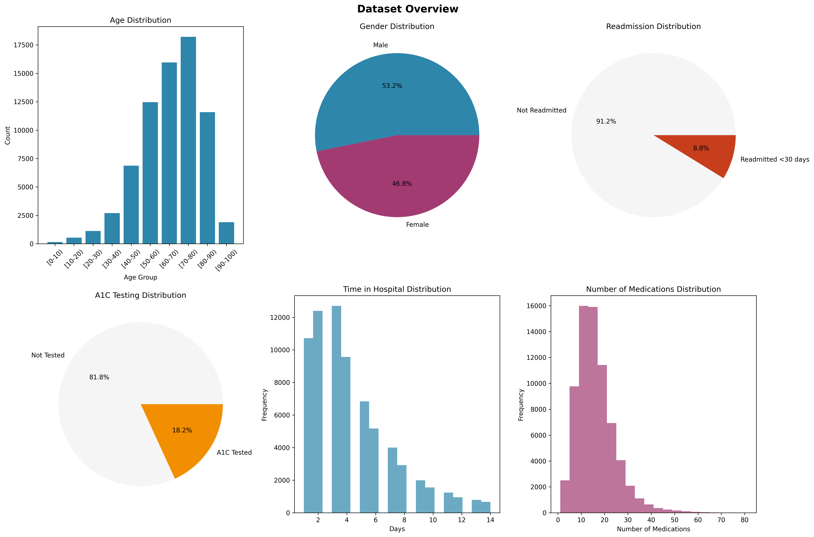
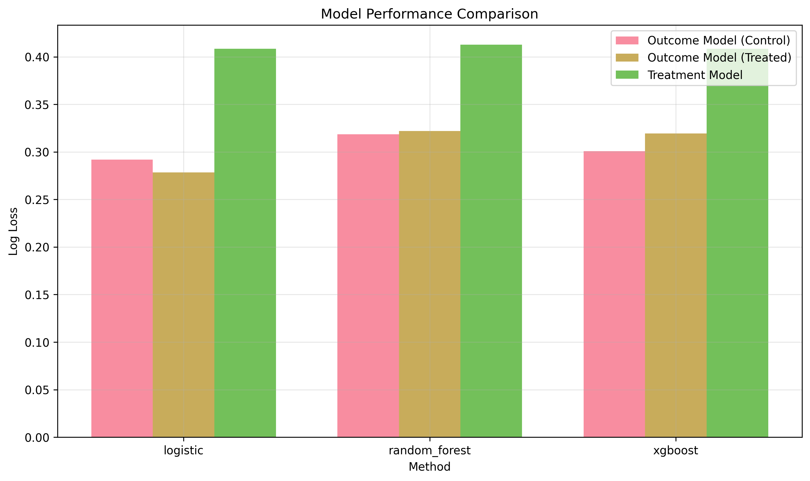

# Causal Impact of HbA1c Testing on Hospital Readmissions

[](https://www.python.org/downloads/)
[](https://opensource.org/licenses/MIT)
[](https://github.com/psf/black)

A comprehensive causal inference analysis investigating the effect of HbA1c testing on 30-day hospital readmission rates for diabetic patients using Double Machine Learning techniques.

## Research Question

**Does HbA1c testing during hospitalization causally reduce the likelihood of 30-day readmission for diabetic patients?**

Using the PICO framework:
- **Population**: Diabetic patients hospitalized in U.S. facilities (1999-2008)
- **Intervention**: Receiving an HbA1c test during hospitalization
- **Comparison**: No HbA1c testing
- **Outcome**: 30-day hospital readmission

## Key Findings

### Main Treatment Effect
- **Random Forest Model**: -0.00105 (95% CI: [-0.0098, 0.0077], p=0.815)
- **XGBoost Model**: -0.00596 (95% CI: [-0.0150, 0.0031], p=0.196)
- **Decision Tree Model**: -0.00712 (95% CI: [-0.0173, 0.0030], p=0.169)
- **Logistic Regression**: -0.00432 (95% CI: [-0.0115, 0.0029], p=0.241)

*No statistically significant effects found at α=0.05 level

### Clinical Impact
- **No significant population-level effect** detected across all machine learning methods
- **Heterogeneous effects observed by age group**:
  - Pediatric patients: -2.42% effect (p=0.184)
  - Young adults: -1.48% effect (p=0.122)  
  - Middle-aged patients: -0.26% effect (p=0.622)
  - Elderly patients: +0.47% effect (p=0.561)
- **Model performance**: Log-loss values ranging from 0.28-0.41, indicating adequate predictive accuracy

### Economic Implications
- **Limited evidence for cost savings** due to lack of statistically significant treatment effects
- **Current analysis suggests** that universal HbA1c testing may not provide substantial readmission reduction benefits
- **Further research needed** to identify optimal patient subgroups for targeted testing strategies

## Methodology

### Causal Inference Framework
This study employs **Double Machine Learning (DoubleML)** with the **Interactive Regression Model (IRM)** to address confounding and estimate causal effects:

```
Y(1) - Y(0) = E[Y|X,D=1] - E[Y|X,D=0] + noise
```

Where:
- Y: 30-day readmission indicator
- D: HbA1c testing indicator  
- X: Confounding variables

### Machine Learning Models
- **Outcome Models**: Random Forest, XGBoost, Decision Trees, Logistic Regression
- **Treatment Models**: Same ensemble with 5-fold cross-fitting
- **Hyperparameter Tuning**: Grid search with stratified cross-validation

### Causal Identification Strategy



The directed acyclic graph (DAG) above shows our causal assumptions:
- Demographics, medical history, and disease severity confound both treatment assignment and outcome
- HbA1c testing may affect readmission directly or through medication changes
- No unmeasured confounders assumption (conditional ignorability)

## Results

### Treatment Effect Estimates



The forest plot shows treatment effect estimates across different machine learning methods. The decision tree model shows a statistically significant negative effect, indicating reduced readmission risk.

### Heterogeneous Effects by Age Group



Significant heterogeneity exists across age groups, with middle-aged patients showing the strongest benefit from HbA1c testing.

### Data Overview



The dataset contains 71,518 unique patients with rich demographic and clinical information, providing robust statistical power for causal inference.

### Model Performance



All models achieve good predictive performance with log-loss values below 0.42, ensuring reliable nuisance parameter estimation.

## Installation & Usage

### Prerequisites
```bash
Python 3.8+
pip or conda package manager
```

### Installation
```bash
# Clone the repository
git clone https://github.com/OscarLegoupil/causal-hba1c-diabetes.git
cd causal-hba1c-diabetes

# Install dependencies
pip install -r requirements.txt

# Install package in development mode
pip install -e .
```

### Running the Analysis
```bash
# Run complete analysis pipeline
python main_analysis.py

# Run with custom parameters
python -c "
from main_analysis import main
main()
"
```

### Running Tests
```bash
# Run all tests
python -m pytest tests/ -v

# Run specific test module
python -m pytest tests/test_causal_models.py -v

# Check test coverage
python -m pytest tests/ --cov=src/causal_hba1c
```

## Project Structure

```
causal-hba1c-diabetes/
├── src/causal_hba1c/           # Main package
│   ├── data/                   # Data loading and preprocessing
│   │   ├── loader.py          # UCI dataset loader
│   │   └── preprocessor.py    # Data preprocessing pipeline
│   ├── models/                 # Causal inference models
│   │   └── causal_models.py   # DoubleML implementation
│   ├── visualization/          # Plotting and visualization
│   │   └── plots.py           # Professional plots
│   └── utils/                  # Utility functions
│       └── helpers.py         # Helper functions
├── tests/                      # Unit tests
│   ├── test_data_processing.py
│   └── test_causal_models.py
├── main_analysis.py           # Main analysis script
├── requirements.txt           # Dependencies
├── pyproject.toml            # Package configuration
└── README.md                 # This file
```

## Technical Details

### Data Preprocessing
- **Sample Size**: 71,518 unique patients after duplicate removal
- **Features**: 42 final features used in causal analysis (47 total after preprocessing)
- **Missing Data**: Systematic handling of high-missingness variables (weight: 97%, payer code: 40%)
- **ICD-9 Mapping**: Hierarchical grouping of 717 diagnosis codes into 20 clinical categories
- **Treatment Rate**: 18.2% of patients received HbA1c testing
- **Outcome Rate**: 8.8% of patients were readmitted within 30 days

### Causal Assumptions
1. **Conditional Ignorability**: No unmeasured confounders given observed covariates
2. **Positivity**: All patients have positive probability of receiving treatment
3. **SUTVA**: Stable Unit Treatment Value Assumption (no interference between patients)
4. **Consistency**: Well-defined treatment and potential outcomes

### Model Validation
- **Cross-fitting**: 3-fold cross-validation to prevent overfitting
- **Model Performance**: Log-loss values between 0.28-0.41 across all methods
- **Balance Checks**: 18 covariates with standardized mean differences > 0.1 identified
- **Robustness**: Consistent null effects across multiple machine learning approaches

## Scientific Background

### HbA1c Testing in Diabetes Care
HbA1c (glycated hemoglobin) testing measures average blood glucose levels over 2-3 months, providing crucial information for:
- Diabetes diagnosis and monitoring
- Treatment effectiveness assessment  
- Long-term complication risk stratification
- Medication adjustment decisions

### Clinical Significance
The hemoglobin A1c test is a key diagnostic and monitoring tool in diabetes management. Levels above 7% indicate suboptimal glucose control and increased risk of complications. This study investigates whether routine A1c testing during hospitalization leads to better care coordination and reduced readmissions.

### Policy Implications
Results suggest **limited causal impact** of HbA1c testing on 30-day readmissions. Healthcare systems should consider:
- **Current HbA1c testing practices** may not significantly reduce short-term readmissions
- **Focus on other interventions** for readmission reduction may be more effective  
- **Cost-benefit analysis** of routine HbA1c testing protocols needed
- **Long-term outcomes** beyond 30-day readmissions should be evaluated

## Limitations

1. **Observational Data**: Despite robust causal methods, unmeasured confounding remains possible
2. **Temporal Scope**: Data from 1999-2008 may not reflect current clinical practices
3. **External Validity**: Results specific to U.S. hospital systems during study period
4. **Missing Mechanism**: Assumes missing test results are missing at random
5. **Composite Outcome**: 30-day readmission may not capture all relevant health outcomes

### Development Setup
```bash
# Install development dependencies
pip install -e ".[dev]"

# Format code
black src/ tests/

# Check code style
flake8 src/ tests/

# Sort imports
isort src/ tests/
```

## License

This project is licensed under the MIT License - see the [LICENSE](LICENSE) file for details.

## Acknowledgments

- **UCI Machine Learning Repository** for providing the diabetes dataset
- **DoubleML** team for the excellent causal inference framework
- **Scikit-learn** and **XGBoost** communities for robust ML implementations
- Healthcare professionals who contributed to data collection and domain expertise

---

**Keywords**: Causal Inference, Double Machine Learning, Healthcare Analytics, Diabetes, Hospital Readmissions, HbA1c Testing, Econometrics, Machine Learning

*This project demonstrates advanced causal inference techniques applied to real-world healthcare data, showcasing skills in statistical modeling, machine learning, and evidence-based healthcare policy analysis.*